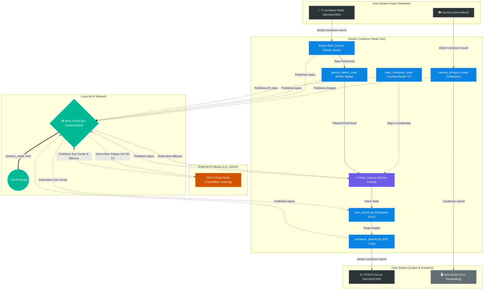

```mermaid
graph TD
    %% Define Styles
    classDef hardware fill:#2d3436,stroke:#b2bec3,stroke-width:2px,color:#dfe6e9;
    classDef ros fill:#0984e3,stroke:#74b9ff,stroke-width:2px,color:#fff;
    classDef fusion fill:#6c5ce7,stroke:#a29bfe,stroke-width:2px,color:#fff;
    classDef display fill:#636e72,stroke:#b2bec3,stroke-width:2px,color:#fff;
    classDef network fill:#00b894,stroke:#00cec9,stroke-width:2px,color:#fff;
    classDef external fill:#d35400,stroke:#e67e22,stroke-width:2px,color:#fff;

    subgraph Host_Input ["Host System (Input Hardware)"]
        Cam["📷 Camera (/dev/video0)"]:::hardware
        Radar["📡 TI mmWave Radar (/dev/ttyUSB0)"]:::hardware
    end

    subgraph Docker_Env ["Docker Container (Head Unit)"]
        CamNode["camera_bringup (Loads Calibration)"]:::ros
        RadarDriver["Radar ROS 2 Driver (Reads Serial)"]:::ros
        TF["static_transform_node (Camera-Radar TF)"]:::ros
        PD["person_detect_node (Filters Radar)"]:::ros
        Intent["🧠 intent_node.py (Sensor Fusion)"]:::fusion
        FT["face_tracker.py (Computes Error)"]:::ros
        PID["actuators_generic.py (PID Loop)"]:::ros
    end

    subgraph External_Device ["External AI Device (e.g. Jetson)"]
        YOLO["YOLO Vision Node (Face/BBox Tracking)"]:::external
    end

    subgraph Host_Output ["Host System (Output & Actuators)"]
        Servos["⚙️ ST3215 Servos (/dev/ttyACM0)"]:::hardware
        Display["🖥️ Host Screen (X11 Forwarding)"]:::display
    end

    subgraph Local_Network ["Local Wi-Fi Network"]
        DDS{"🌐 ROS 2 DDS Bus (CycloneDDS)"}:::network
        Router(("📶 Wi-Fi Router")):::network
    end

    %% Flow: Hardware -> Docker
    Cam -->|"docker-compose mount"| CamNode
    Radar -->|"docker-compose mount"| RadarDriver
    
    %% Internal Head Logic
    RadarDriver -->|"Raw PointCloud"| PD
    TF -.->|"Aligns Coordinates"| Intent
    PD -->|"Filtered PointCloud"| Intent
    Intent -->|"Intent State"| FT
    FT -->|"Target Angles"| PID
    PID -->|"docker-compose mount"| Servos
    
    %% Distributed Network Flow
    CamNode -.->|"Publishes Images"| DDS
    DDS -.->|"Subscribes Images (via Wi-Fi)"| YOLO
    YOLO -.->|"Publishes Eye Center & BBoxes"| DDS
    
    DDS -.->|"Subscribes BBoxes"| Intent
    DDS -.->|"Subscribes Eye Center"| FT

    RadarDriver -.->|"Publishes topics"| DDS
    Intent -.->|"Publishes topics"| DDS
    PD -.->|"Publishes topics"| DDS
    PID -.->|"Publishes topics"| DDS
    TF -.->|"Publishes /tf_static"| DDS
    
    DDS == "network_mode: host" ==> Router
    
    %% UI Display
    CamNode -->|".Xauthority socket"| Display
```
